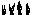

Smoothie
========

Smoothie is a utility for generating smoothly-looping sprite animations for Chip8 programs from a horizontal sprite sheet. By building a sequence of sprite frames which are XORed with the previous frame in the sequence it is possible to draw animations without needing to erase and then redraw, reducing flicker. Both 8xN and 16x16 SuperChip sprites are supported.

If a color image is provided, Smoothie will assume black is the blended color and transparent is the background color and arrange each sprite with data for plane 1 followed by plane 2.

Compiling is easy:

	javac Smoothie.java
	java Smoothie
	usage: smoothie [--toimage] [--raw] [--pad] <filename>

By default, Smoothie will output hex sprite data for the looped animation. The first frame in the output is the first frame of the sprite sheet (for drawing initially), and then each subsequent frame is an XOR delta from the previous frame in the looped sequence.

Our input image: 

	java Smoothie snap.png
	# color 0: 0x00FFFFFF
	# color 1: 0xFF000000
	: snap-0
		0x00 0x00 0x00 0x00 0x00 0x28 0x28 0x28
		0x28 0x3C 0x34 0x3C 0x3C 0x3C 0x38 
	: snap-1
		0x00 0x00 0x00 0x10 0x30 0x18 0x10 0x10
		0x14 0x08 0x08 0x00 0x00 0x04 0x00 
	: snap-2
		0x00 0x00 0x00 0x02 0x42 0x6E 0x66 0x44
		0x54 0x48 0x48 0x04 0x04 0x00 0x04 
	: snap-3
		0x00 0x10 0x30 0x32 0x7A 0x3E 0x32 0x10
		0x08 0x08 0x44 0x00 0x00 0x00 0x00 
	: snap-4
		0x00 0x10 0x30 0x20 0x08 0x48 0x44 0x44
		0x48 0x48 0x04 0x04 0x04 0x04 0x04 

The `--pad` option can be used to pad sprite data to an even number of bytes, which often makes address calculations more convenient.

The `--raw` option directly converts the input sprite sheet into hex data, performing no masking. This can be useful for bulk conversion of image data.

The `--toimage` option writes output to a PNG instead of hex data for convenient visual inspection: 
